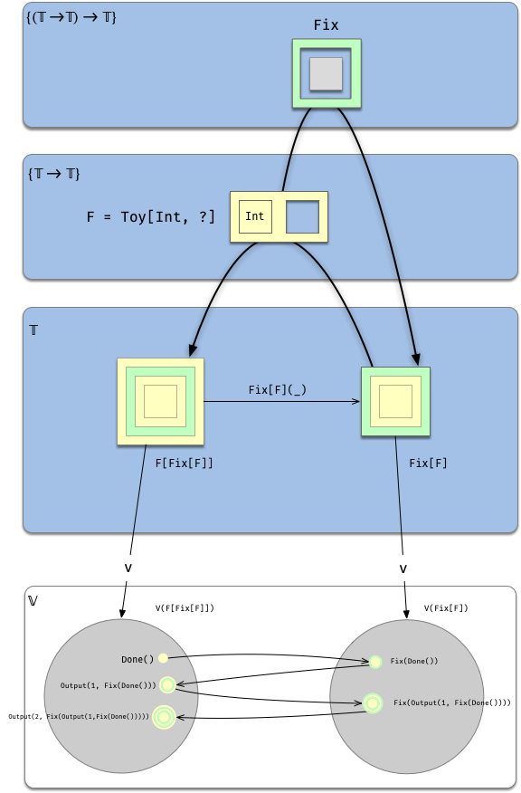

### Using type constructors 

We'll discuss type constructors below, but for now we'll just mention that the expression:

```scala
List[Int]
```

describes a **brand new**, totally legit type created by providing `Int` as an argument of `List`.

The expression:

```scala
type JobId = Int
```

on the other hand, doesn't describe any new type. `JobId` is just an alias for `Int`.


## Set comprehension

Set comprehension is a common way to describe sets in Mathematics. It comes in two flavors:

1. By predicate
2. By enumeration

We can use a similar idea to come up with types that correspond (under $V$) to interesting values.

### Given an arbitrary predicate

For each set $X$ and each predicate $P$ we can form the set $Q = \{x \in X | P(x)\}$

The direct analogue in our setting would be:

Given a type `X` and a a function `P: X => Boolean`, form the type `Q <: X` with the property that
$V(Q) = \{x <: X | P(x)\}$

This is not directly supported by Scala, but it can be simulated somehow by using a smart constructor (or similar mechanism).

```scala
sealed class PositiveInt private (x: Int)

object PositiveInt {
  def apply(x: Int): PositiveInt = {
    assert(x > 0)
    new PositiveInt(x)
  }
}
```

Although `PositiveInt` is not a subtype of `Int` it can clearly be used anytime an `Int` is needed, so we could create
 an implicit conversion (or something similar). (It is morally a subtype of `Int`)

Now, the "native" mechanism to create subtypes in OO languages is different:

- You can only extend some types (non final trait or classes)
- The subset of values obtained this way is not completely arbitrary:
  Only values obtained by making abstract fields concrete, or providing abstract subtypes
  of abstract fields.

### Refined types

### By Enumeration

### Algebraic data types

#### Sets containing sets

This is one of the main differences between sets and Scala types.

Given two sets $X, Y$ we can form the set $\{X, Y\}$ whose members are exactly $X$ and $Y$.

Clearly the scheme we've use so far (the function $V$) does not work in this case, since this would require creating a type `T` whose associated values are two types `X, Y`.

[can this be emulated by using dependent types or type members?]

## Type members

A type member also defines a type function.


# Example: Fixpoint

(Full example [here](http://eed3si9n.com/learning-scalaz/Free+Monad.html))

https://medium.com/disney-streaming/fix-point-type-for-gadt-scala-dc4e2cde349b

Consider a toy language:

```scala
 sealed trait Toy[+A, +Next]
 case class Output[A, Next](a: A, next: Next) extends Toy[A, Next]
 case class Done() extends Toy[Nothing, Nothing]
```

And a sequence of operations like so:

```scala
Output(2, Output(1, Done()))
```

Handling this kind of expressions is complicated because every new operation adds another layer to the type of the expression:

```scala
val t0:                   Toy[Nothing, Nothing]   =                     Done()
val t1:          Toy[Int, Toy[Nothing, Nothing]]  =           Output(1, Done())
val t2: Toy[Int, Toy[Int, Toy[Nothing, Nothing]]] = Output(2, Output(1, Done()))
```

Enter `Fix` to the rescue:

```scala
case class Fix[F[_]](unfix: F[Fix[F]])
```

Observe that `Fix` simplifies the type of its argument (`unfix`): it is removes the outermost layer `F`:
$$
\mathtt{F[Fix[F]]}\rightarrow\mathtt{Fix[F]}
$$
`Fix` can be used to wrap each `Toy` value, like so:

```scala
// let's create an alias to simplify things
type F[A] = Toy[Int, A]

implicitly[Nothing <:< Fix[F]]

val f0: F[Fix[F]] =                                          Done(): F[Nothing]
val f1:   Fix[F]  =                                   Fix[F](Done())
val f2: F[Fix[F]] =                         Output(1, Fix[F](Done()))
val f3:   Fix[F]  =                  Fix[F](Output(1, Fix[F](Done())))
val f4: F[Fix[F]] =        Output(2, Fix[F](Output(1, Fix[F](Done()))))
val f5:   Fix[F]  = Fix[F](Output(2, Fix[F](Output(1, Fix[F](Done())))))
```


Let's first focus only on the types involved :


