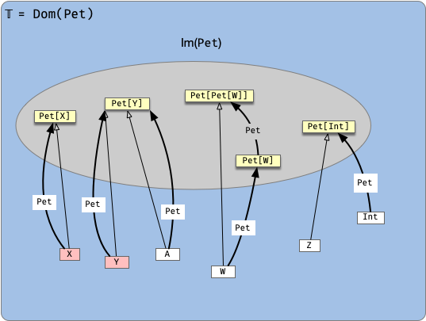
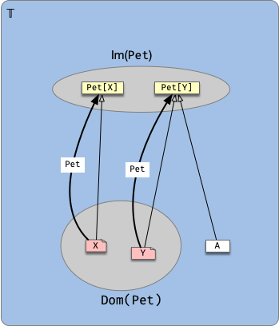
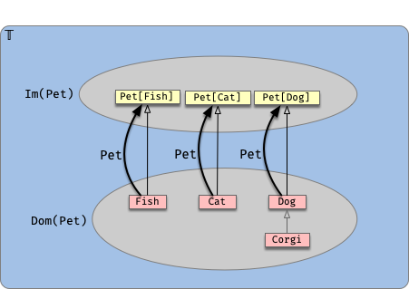

## F-Bounded types


Consider the following definitions (taken from [Returning the "Current" Type in Scala](https://tpolecat.github.io/2015/04/29/f-bounds.html)) by Rob Norris.

```scala
trait Pet[A <: Pet[A]]{ this: A => }

class Fish extends Pet[Fish]
class Cat  extends Pet[Cat]
class Dog  extends Pet[Dog]
```

This is a solution to a problem posed in the mentioned article:

> ensure that only definitions of form `class A extends Pet[A]` are valid.

The definition of `Pet` can be confusing, so let's upack it slowly.

Let's start by removing the type constraint and see what possibilities are available.

Note: If the definition `class A extends Pet[A]` confuses you, think of it in steps:

```scala
// 0. The type constructor has to exist already:
trait Pet[A] { ... }
// 1. We'll create a new class
class X
// 2. That extends another type
class X extends ???
// 3. that happens to be Pet[X]
class X extends Pet[X]
```

Now, this is a strange type, since in general we know that `A` and `F[A]` are different types (in many cases `F[A]` is a container of `A` values).

What do we know in this case?

* Some of the attributes of `X` 


```scala
trait C[A] { val a: A }
// this will loop forever
class X extends C[X] { val a = new X }
// new Y(new Y(...))
class Y(b: Y) extends C[Y] { val a = b }

//
class X extends C[X] { val a = this }
```


Consider the function `A` that sends a class / trait to the set of its attributes. For example

```scala
case class Point(x: Int, y: Int)

A[C] == {(val x: Int), (val y: Int)}
```

Let $\mathbb{A}$ be the set of all atributes. Then
$$
X <: Y\ \mathrm{implies\ that}\ \mathbb{A}(Y)\subset \mathbb{A}(X)
$$


Ok, let's consider several possibilities:

```scala
// Consider first a type function with no constraints:
trait Pet[A]

// for the following examples, is it true that A <: Pet[A]?

// yes
class X extends Pet[X]
class Y extends Pet[Y]
class A extends Pet[Y]

// no
class W extends Pet[Pet[W]]
class Z extends Pet[Int]
```

Since there are no constraints, the domain is the whole $\mathbb T$.



As you can see there are two kinds of arrows involved here: the subtype arrows and the type function `Pet` arrows.

Graphically we're looking for 2 conditions:

1. Both arrows coincide.
2. Each `Pet[X]` has only one direct subtype (`X`).

So what happens if we now add the constraint `A <: Pet[A]` to the definition of `Pet`?

```scala
trait Pet[A <: Pet[A]]

// valid:
class X extends Pet[X]
class Y extends Pet[Y]
// still valid, because Y <: Pet[Y]
class A extends Pet[Y]

// doesn't compile:

// class W extends Pet[Pet[W]]
//      because W does not extend Pet[W]

// class Z extends Pet[Int]
//      because Int does not extend Pet[Int]
```




If we want to eliminate the possibility of `class A extends Pet[Y]` we have to use another trick: **self-type annotations**.

```scala
trait Pet[A <: Pet[A]] { this: A => }
```

The bit `this: A =>` indicates that whenever `Pet[A]` is used (extended, or mixed in), it has to be with `A` or a subtype of `A`:



Observe that the example `class A extends Pet[Y]` above is not valid anymore because `A` is not a subtype of `Y`.

And this is as far as we can go to restrict the domain of type constructors using this approach.
