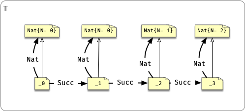

## Natural numbers

```scala
trait Nat {
  type N <: Nat
}

case class Succ[P <: Nat]() extends Nat {
  type N = Succ[P]
}
```

Which is morally equivalent to

```scala
trait Nat[N <: Nat] 

case class Succ[P <: Nat] extends Nat[Succ[P]]
```

```scala
class _0 extends Nat {
    type N = _0
}

type _1 = Succ[_0]
type _2 = Succ[_1]
type _3 = Succ[_2]
```

