# Illustrated guide to Types, Sets and Values.

This document is a graphical exploration on the relationship between Types, Sets and Values.

The goal is to help develop an intuition about types, by representing them graphically in a very concrete way: as labels or post-its attached to expressions.

Audience: Beginner.

---


[TOC]

**Note:**

We'll be talking about two different notions of functions:

- [Mathematical functions](https://en.wikipedia.org/wiki/Function_(mathematics)). They are abstract, and can be defined between two arbitrary Sets. They "live" in our heads, so to speak.
  - We'll use the notation `A → B` in this case.
- Scala functions and methods.
  - We'll use `A => B` in this case.

The two notions are **not** the same:

- A Scala function correspond to a mathematical function only when it is pure.
- There are many mathematical functions that are not expressible as Scala functions (as an obvious example consider the function `V` that maps types to sets of values defined below)


## What are types?

We'll start by declaring types to be just **labels** (think of tags / post-its, etc)  assigned to expressions. 


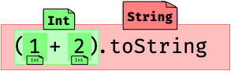


## Preliminaries

Let's call `𝕋` the set of all types, `𝕍` the set of all values, and consider the function `V` that maps each type to its set of possible values:

```
V: 𝕋 → 𝒫(𝕍)
```

>  Note: `𝒫(𝕍)` is the [power set](https://en.wikipedia.org/wiki/Power_set) of `𝕍` (the set of all its subsets).

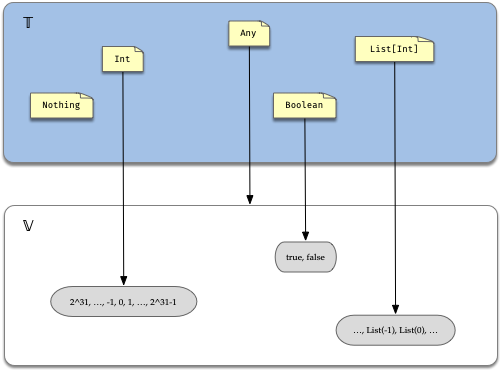


As you can see, the function `V` allows us to distinguish values of different characteristics from each other. 

In a dynamic language such as Python on the other hand, all values have a single label assigned to them, which we can call `Dynamic`. 

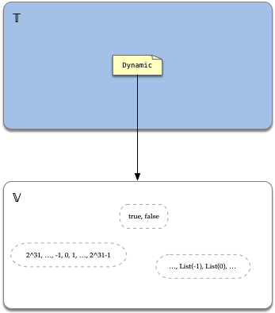

You might be thinking that even in Python there are different kinds of values: numbers, lists, dicts, etc. 

This is true: they definitely have a different representation in memory. But the distinction between the number `1` and the string `"one"` only exists at **runtime**.  As far as the interpreter is concerned, they are the same, and will happily attempt to perform `1 / "one"`, only to throw an exception.

```python
>>> 1 / "one"
Traceback (most recent call last):
  File "<stdin>", line 1, in <module>
TypeError: unsupported operand type(s) for /: 'int' and 'str'
```

What about the human writing or reading the program? Well, we *try* to be aware of such a difference, with varying degrees of success.

So when we talk about types, we are talking about a **static** property that the typechecker can verify without running the code, not the specifics of the in-memory binary representation of values at runtime.

#### Notation

The expression `1: Int` means that `1` is a value whose type is `Int`.  

In terms of the function V defined above this corresponds to the statement `1 ∈ V(Int)`.
#### Some examples of types and corresponding set of values

|Type | Set of possible Values | Size |
|---|---|---|
|`Nothing` | `{}` | `0` |
|`Unit` | `{ () }` | `1` |
|`Boolean` | `{true, false}` | `2` |
|`Int` | `{ -2^31, ...,0,..., 2^31 - 1 }` | `2^32` |
|`String` | The set of all strings | `∞`  |
|`(A, B)` | `{(a,b) | a ∈ A, b ∈ B}` | `|A| × |B|` |
|`Either[A, B]` | `{l: Left[A, B]}` + `{r: Right[A, B]}` |  `|A| + |B|`  |
|`Any` | `𝕍` | `∞`  |

In this list, some types are "atomic" or "simple", while others are derived from other types by combining them in different ways.

This is going to be one of our main themes: we'll systematically explore different ways to combine types and analise the resulting *set* of values.

Another important theme is that in order to keep things simple we'll basically ignore the *meaning* of values of a given type. Values will be represented as mere featureless points in a set.

## Simple types

First thing first: how do we even create new types?

Consider the following definitions:

```scala
// `sealed` + nobody extending it on the current file == no values of type T can be created.
sealed trait T

// a singleton object
object O

// nobody can create more values of type X outside of the current file
sealed trait X
case object A extends X
case object B extends X
case object C extends X

class Point(x: Int, y: Int)
```

At this point we have introduced 4 new types (labels) into our program:

| Type     | Set of possible Values                             | Size                      |
| -------- | -------------------------------------------------- | ------------------------- |
| `T`      |     `{}`                                         | 0                         |
| `O.type` | `{O}`                                              | 1                   |
| `X`      | `{A, B, C}`                             | 3                        |
| `Point`  | `{Point(x,y) |  x,y ∈ Int }` | 2^32 * 2^32 = 2^64 |


Note: from now on we'll use simple rectangles to denote labeles

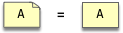

## Families of types: Functions in `𝕋`

Consider the following declaration

```scala
trait F[A] { ... }
```

An expression of the form `F[A]` is a (math) function from types to types:

```
F:  𝕋  →  𝕋 
    A  ↦ F[A]
```


We can *apply* this function to a type, and the result will be another, **brand new** type.

We'll represent type functions as incomplete labels (or labels with holes). Once the missing label is provided we get a proper label.

Using `List` as an example:

```scala
// Declaration
trait List[A] { ... }
// Usage:
val l: List[Int] = ...
```

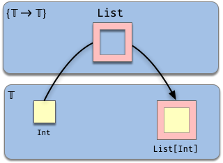

The top rectangle represents `{ 𝕋 → 𝕋 }`, the **set of all (simple) type functions** , of which `List` is a member.

To be clear: `List​` is **not** a Scala function. But it is a mathematical function.

```scala
// More examples:
trait Future[A] { ... }

// Usage:
val ll: List[List[Int]] = ...
val ts: Future[String]  = ...

// Invalid:
// List[List]
// Future[List]

// A type alias:
type DoubleList[A] = List[List[A]]
// Applying a type alias does not create new types!
// DoubleList[Int] is the same type as List[List[Int]]
```

In the expressions above:

* `List` is not a type, it needs a value to become a type. It is a *type constructor*.

* `List[Int]` **is** a legit new type. 

* `List[Try]` is invalid, because the declared argument of `List`  has to be a proper type.

* Type functions allows us to create *families* of related types (and values):

  Even though `List[Int]` and  `List[String]` are different types, they are clearly related (and we can expect the corresponding values to also be related somehow).

  * We can say that a type function like `List` gives rise to a family of types 
    
    ```scala
    { List[A]  |  A ∈ 𝕋 }
    ```
    
    (which is just the image of `List`)

    And also gives rise to a family of sets of values.


Another example:

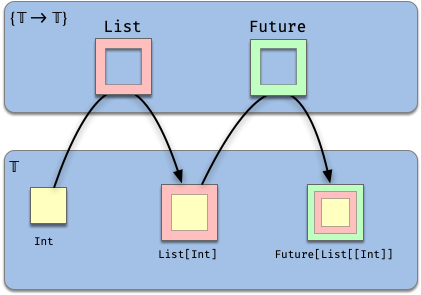


One difference between type functions and regular (math) functions is that applying type functions just acumulate its arguments. i.e. there is not automatic simplification.

For example:

```scala
List[Either[(Int, A), Map[Int, String]]]
```

(Hence the need for type aliases)

### Functions of multiple arguments

Otherwise identical to single-argument functions, except with more than one hole.

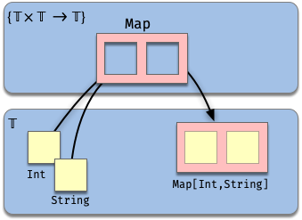

The signature of such functions is

```
𝕋 × 𝕋 →  𝕋
```

Examples:

```scala
Map[A, B]
Function[A, B]
Tuple2[A, B]
Tuple3[A, B, C]
Either[A, B]
// etc
```

The signature of a type function is called its **kind**:

- Regular types have kind `Type`. (i.e.  `𝕋`)
  - They are also called *proper* types.
- `Map` and `Function` have kind `(Type, Type) => Type` (i.e. 𝕋 × 𝕋 →  𝕋)

### More type functions

Before continuing let's examine different expressions that give rise to type functions:

| Incomplete types        | Proper types (evaluated at `Int`) | Notes                    |
| ----------------------- | --------------------------------- | ------------------------ |
| `Map[Int, ∎]`           | `Map[Int, Int]`                   |                          |
| `Function[Int, ∎]`      | `Function[Int, Int]`              |                          |
| `Function[∎, String]`   | `Function[Int, String]`           |                          |
| `Tuple3[Char, ∎, Long]` | `Tuple3[Char, Int, Long]`         |                          |
| `List[Future[∎]]`       | `List[Future[Int]]`               |                          |
| `trait N { type A }`    | `trait N { type A = Int }`        | Abstract type member `A` |

>  Note: The square block `∎` is not valid Scala syntax!  
>
> It's just a way to represent the fact that a type is missing at that position, and if we fill the gap, then we will have a proper type. 

Vanilla Scala 2.x does not provide native syntax to create anonymous type functions, but we can use the compiler plugin [Kind Projector](https://github.com/typelevel/kind-projector) to overcome this limitation.

For example the type function `Map[Int, ∎]` obtained by removing the second type argument of `Map` can be expressed using kind projector as `Map[Int, ?]`.

[Dotty](https://dotty.epfl.ch/docs/reference/new-types/type-lambdas.html) on the other hand adds the syntax `[A] =>> F[A] ` for this purpose.

### (Type) function composition

As expected, type functions can be composed. 

For example, the composition of `List` and `Try` is the function `F[A] = Try[List[A]]`

```
F: 𝕋 → 𝕋
   A ↦ F[A] = Try[List[A]]
```


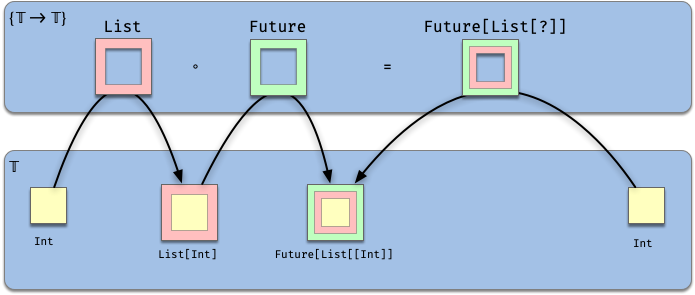

### Identity function
As with any set, there is an identity function in the set of types `𝕋` . This can be expressed in Scala like so:

```scala
type Id[A] = A
```


### High order functions
We can also describe type functions that receive another type function as argument. 

```scala
// Declaration:
trait H[F[_]] { ... }
//        ▲
//        |
//  The single argument F has to be a type function 𝕋 → 𝕋

// Usage:
val listH: H[List] = ???
// Once Functor is evaluated, the result is a proper type!
```

A high order type function has an "hole" with a very specific shape: *only* regular type functions can be used as arguments. Once this argument is provided the result is a proper type.

Since `H` takes a function and returns a proper type, it has kind `(𝕋 → 𝕋) →  𝕋`.

Here's an attempt to represent this graphically:

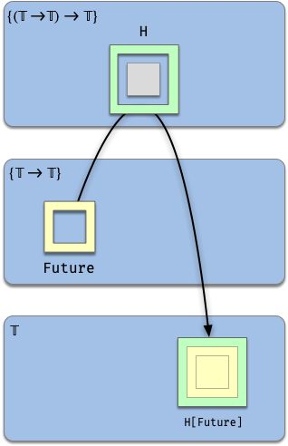

More examples:

```scala
// Declaration:
// The argument F has to be a one-argument type function
trait Functor[F[_]] { ... }

// The argument F has to be a two-argument type function
trait Category[F[_, _]] { ... }

// Usage:
val funcFunctor: Functor[Function[Int, ?]] = ...
val eitherCategory: Category[Either] = ...
```

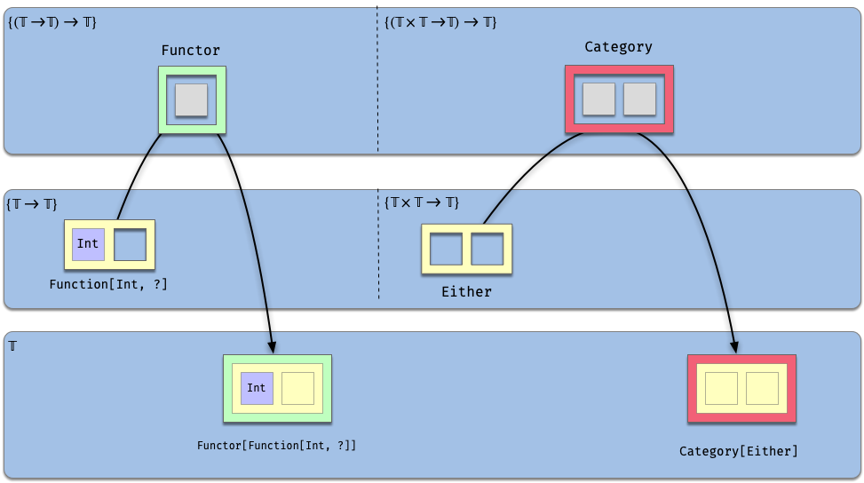


Taking the idea further, how about a function that accepts arguments of a shape/kind like `Functor`? 

```scala
trait N[G[_[_]]]
```

* `N` takes one argument: `G`
* `G` takes one (anonymous) argument of shape `𝕋 → 𝕋` (i.e. a type function such as `List`)
* Hence the signature (kind) of `G` is `(𝕋 → 𝕋) → 𝕋`.
* And  `N` has signature (kind) `((𝕋 → 𝕋) → 𝕋) → 𝕋`

```scala
// valid:
N[Functor]
N[Monad]

// invalid, not the right shape:
// N[List]
// N[Int]
```

Graphically:

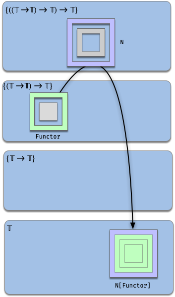


## Subtypes and sets

In Scala and similar languages the set of types `𝕋` has the structure of a [lattice](https://en.wikipedia.org/wiki/Lattice_(order)) under subtyping: 

```
A <= B ⟺ A <: B
```


> The above diagram of `𝕋` does not show all subtype arrows; it only shows the "direct" or "minimal" arrows. But since subtyping is a transitive relation, if `A <: B` and `B <: C` then `A <: C`. This last arrow is *not* shown on the diagram (it can be derived and it would make for a very cluttered diagram).

Using  our mapping V between types and sets of values we get an analogue structure on 𝒫(𝕍):


If  `A <: B`  then `V(A) ⊂ V(B)`:


To  `A <: B` we can associate the inclusion function `i: V(A) ↪ V(B)` between the corresponding set of values.

## Set related operations

The correspondence between subtyping and subsets mentioned above naturally leads us to consider what other operations on types can we do based on operations on the corresponding set of values.

Let's start by creating a little dictionary between sets and types.

Concept / Operation | On sets | On types
--- | --- | ---
Universe set | `U` | `Any`
Empty set | `{}` | `Nothing`
Name (alias) | `X = ...` | `type X = ...`
Element membership | `a ∈ A` | `a: A`
Subsets | `A⊂ B` | `A <: B`
Union | `X ∪ Y` | ([Dotty](https://dotty.epfl.ch/docs/reference/new-types/union-types.html) `X | Y`) 
Disjoint Union | `X + Y` | `Either[X, Y]`
Intersection | `X ∩ Y` | `X with Y` ([Dotty](https://dotty.epfl.ch/docs/reference/new-types/intersection-types.html) `X & Y`) 
Cartesian product | `A × B` | `(A, B)`

### [Union](https://dotty.epfl.ch/docs/reference/new-types/union-types.html) of two types (Dotty)

The union of types `A` and `B` is the type  `A | B` defined as 

```
V(A | B) = V(A) ∪ V(B)
```

i.e. its values are the union of the values of `A` and `B`.

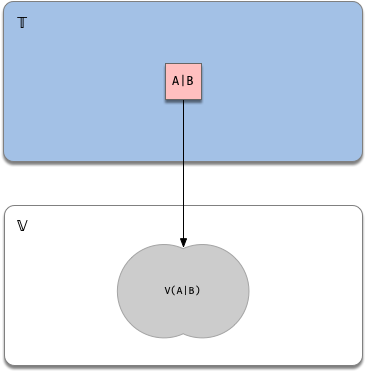

Properties

* `|` is commutative and associative.

* `A` is a subtype of `A | B` (and similar for `B`)

* If `A <: C` and `B <: C` then `A | B <: C`

  

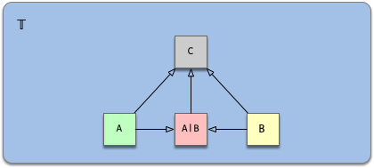


### [Intersection](https://dotty.epfl.ch/docs/reference/new-types/intersection-types.html) of two types (Dotty)

The intersection of types `A` and `B` is the type  `A & B` defined as 

```
V(A & B) = V(A) ∩ V(B)
```

i.e. its values are the intersection of the values of `A` and `B`.

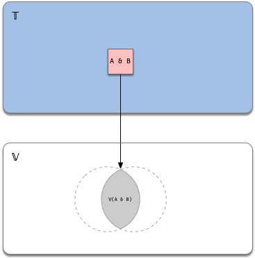

Properties

* If `A <: X` then `A & B <: X`
* If `B <: X` then `A & B <: X`
  * In particular `A & B <: A` and  `A & B <: B`
* If `T <: A` and `T <: B` then `T <: A & B`

Which are rather natural if we think on its effect in the corresponding sets of values.

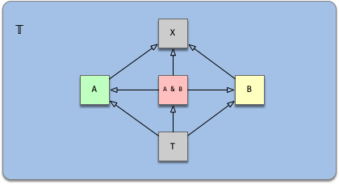

Intersection of types is defined in a *structural* way in the sense that values of `A & B` must have all the *properties* (members) of `A` and all the members of `B` .

Note: In Scala 2.x the keyword `with` can be used for similar purposes. The main difference is that it is not commutative.

## Subtypes and type functions

Let's discuss now the interaction between subtypes and types functions.

Before that let's remember quickly about the domain and image of a function.

### Domain and image of type functions

The **domain** of a type function `F` is the set of all types `A ∈ 𝕋` for which `F[A]` is defined. The **image** of F is the set of all types of the form `F[A]` for some `A`. 

In the examples we've seen so far our functions (such as `List` or `Future`) have been defined for all types, making the domain the whole set of types `𝕋`. 

On the other hand, the image of `List` is a proper subset of `𝕋`:

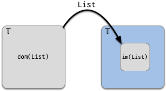


This means that we can construct a list of **any** type, but not all types are lists (duh!).

What if we want to restrict domain of a type function to be not the whole `𝕋` but rather just a proper subset of it? 

There are different ways to accomplish this, all we see in the following sections.

#### The set of subtypes of a given set

The simplest way to come up with a proper set of types (and corresponding values) is to use subtyping.

Consider the set in `𝕋` of all the subtypes of a given type A:

```
Sub(A) = { Y | Y <: A } ⊂ 𝕋
```

(This is sometimes described as `↓ A`)

##### Example

Given

```scala
trait Pet
class Fish extends Pet
class Dog  extends Pet
```

Then

```
Sub(Pet) = {Pet, Fish, Dog, Null, Nothing}
```

Graphically:

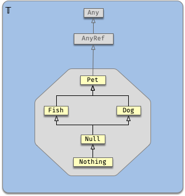


Analogously for supertypes.


### Type constraint: Invariant type functions

Consider this definition:

```scala
trait F[A <: X]
```

`F` is a type function whose argument `A` is now restricted to be a subtype of `X`. In other words

```
dom(F) = Sub(X)
```

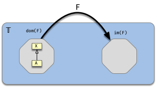

(If `X` happens to be `Any` then we're back to the "no restrictions" case).

`F` as defined does not preserve the subtyping relationship: The elements of its image have no subtyping relationship amongst each other.

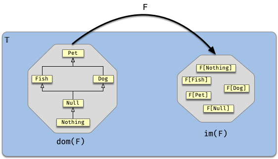

#### Type constraint: Covariant type functions

If we add the `+` annotation then we're declaring that subtypes will be carried over to the image:

```scala
trait F[+A <: X]
```

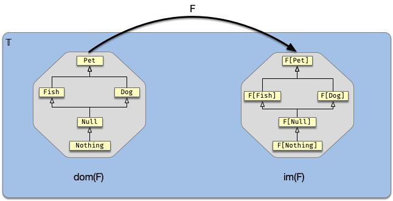


#### Type constraint: Contravariant type functions

The annotation `-` will reverse the subtype arrows:

```scala
trait F[-A <: X]
```


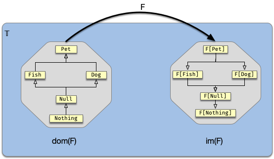


> Variance annotations `+`, `-` cannot be applied to an *arbitrary* function `F[_]`. They are only allowed on type functions whose implementation satisfy the variance rules ([more information](https://docs.scala-lang.org/tour/variances.html)).


Subtyping gives an easy way to create sets of types and sets of values, but the downside is that it's not very flexible, in the sense that we cannot add pre-existing types to a given hierarchy (i.e. we cannot retroactively make one type extend another).

The **Type Class** pattern provides a way to overcome that limitation. Before examining it we need to talk briefly about implicits.

## Implicits

The implicit mechanism allows us to *mark* a value of a given type (say `a: A`) and elsewhere in our code summon this value (i.e. retrieve it, get a reference to) by refering to the type A only.

In practice this amounts to having a **compile time** function (let's call it `implicitly`) from types to values

```
implicitly:  𝕋  →  𝕍
             A  ↦ a ∈ A
````

for example:

```scala
implicit val ec: ExecutionContext = ???
...
// later
implicitly[ExecutionContext] == ec
```

Given that in general there can be many values of a given type, in order for this mechanism to work  the specific value `a` has to be selected *beforehand* (by marking it as an implicit value), and we cannot have more than one value marked as implicit at the point where it is summoned.

Another interesting aspect of this function is that even tough its codomain is the whole set of values `𝕍`, the actual result is not arbitrary, but rather it's always a value of the given type.

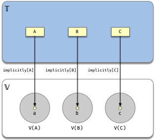

## Type Classes

Quoting [Scala with Cats](https://underscore.io/books/scala-with-cats/):

> A *type class* is an interface or API that represents some functi􏱦onality we want to implement.
>
> ... [It] is represented by a trait with at least one type parameter.

It has three ingredients:

 **1) A Type Function**: capture all the desired properties of a type `A` in a trait parameterized by `A`.

Example: [Monoid](https://en.wikipedia.org/wiki/Monoid)

```scala
trait Monoid[A] {
  def empty: A
  def combine(a: A, b: A): A
}

// Monoid laws:
// 1. Associativity: (a • b) • c = a • (b • c)
// 2. Identity element: e • a = a • e = a 
forAll[A](implicit M: Monoid[A]) { (a: A, b: B, c: A) => 

	assert(M.combine(M.combine(a, b), c) == M.combine(a, M.combine(b, c)))

  assert(M.combine(M.empty, a) == M.combine(a, M.empty) == a)
}
```

**2) Instances**: Make a given type a member of the type class by creating implicit lawful instances for required types:

```scala
implicit val intMonoid = new Monoid[Int] {
  def empty: 0
  def combine(a: Int, b: Int) = a + b
}
implicit val stringMonoid = new Monoid[String] {
  def empty: ""
  def combine(a: String, b: String) = a + b
}
// make sure each instance actually passes the Monoid laws!
```

"Make a given type a member" is not something that has a native construct in Scala. Instead, it is understood in the following sense:

> We're going to *overload* the word Monoid to refer to the set of types for which a lawful implicit instance of  `Monoid[A]` exists! (see diagram below)

"Lawful" means that our instance acually passes the tests asserting the Monoid laws

So given the definitions above we can say that "`Int` is a Monoid", *because* there is an implicit instance of `Monoid[Int]` in scope.

Even though the function `Monoid` can be applied to any type `A` (hence the domain is all `𝕋`), we can't necessarily create a lawful instances for every such `A`.

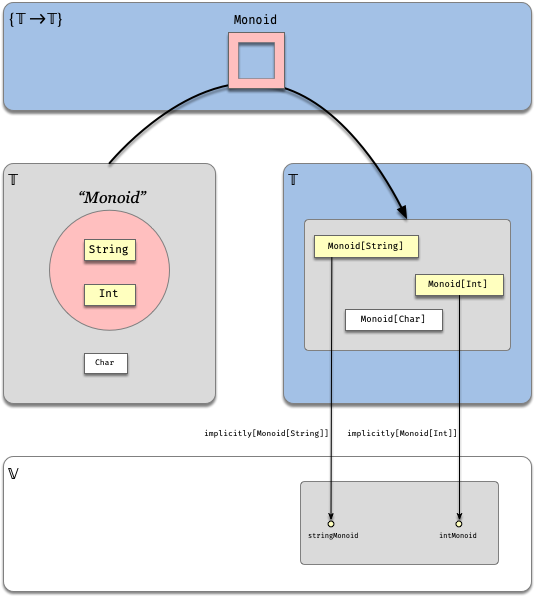

In this diagram:

* `Char` and `Monoid[Char]` are shown in white to indicate that even though `Monoid[Char]` is a valid type, as long as there is no lawful implicit instance (value) of it in our code, then we don't consider it to be a member of the "Monoid" Type Class set (depicted in pink).

  

The definition of the *Monoid* set is a bit indirect, so perhaps considering the following function will make it clear:

```
theMonoid:  𝕋  →  𝕍
            A  ↦ implicitly[Monoid[A]]
```

* `theMonoid` maps a type `A` into a single value: the implicit instance for `Monoid[A]`. 
* `theMonoid` is *only defined* for types with an implicit instance of `Monoid`. Otherwise you get a compilation error.

This means that the *Monoid* set is just the domain of `theMonoid`.  

Graphically:

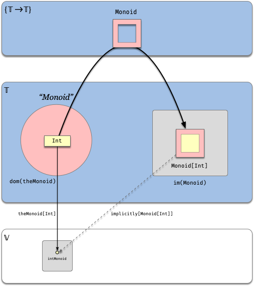


**3) Client code**: program against this trait whenever the functionality is desired:

```scala
def combineAll[A](as: List[A])(implicit M: Monoid[A]): A = 
	as.foldLeft(M.empty)(M.combine)

// usage:
combineAll(List(1,2,3)) == 6
combineAll(List("hello", " ", "world!")) == "hello world!"
```

`combineAll` is actually a family of functions (one for each type `A`):

```
{combineAll_{A ∈ 𝕋}: List[A] × Monoid[A] → A}
```

We can see that if no instance of `Monoid[X]` (for a type `X`) exists, then there's no way we can use `combineAll[X]`.

Type Classes gives us the ultimate flexibility to define subsets of types with desired properties: since we can "add" members one by one as we did above.
